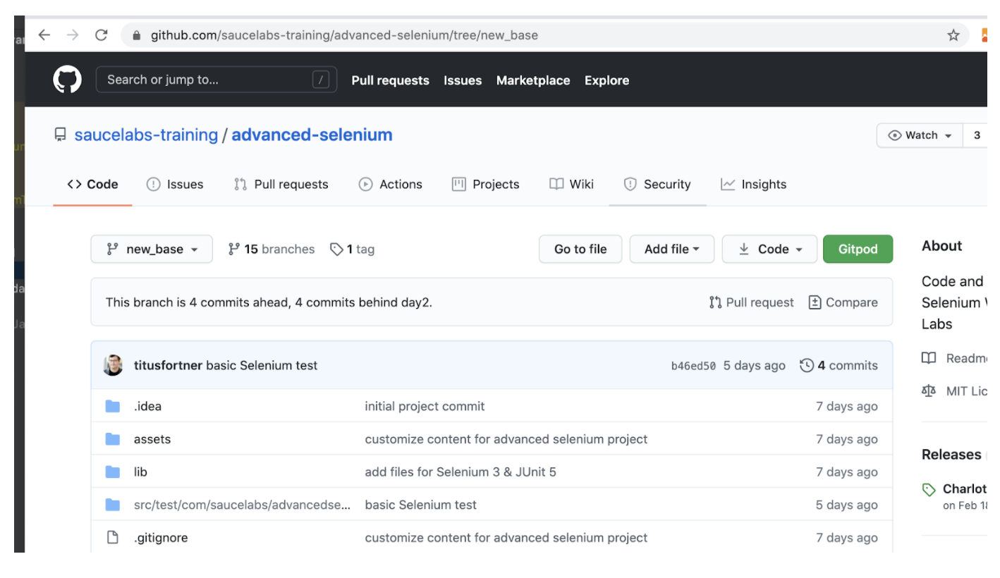
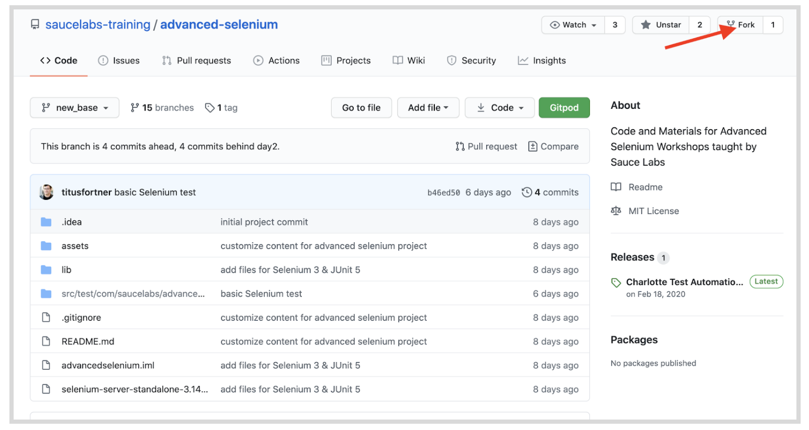
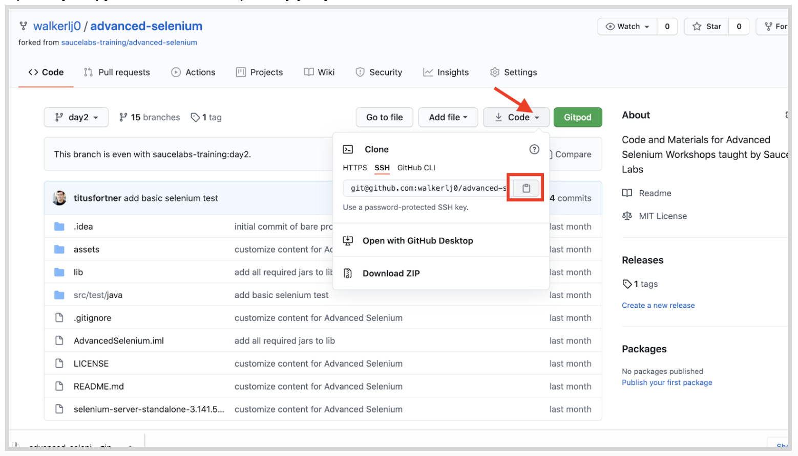
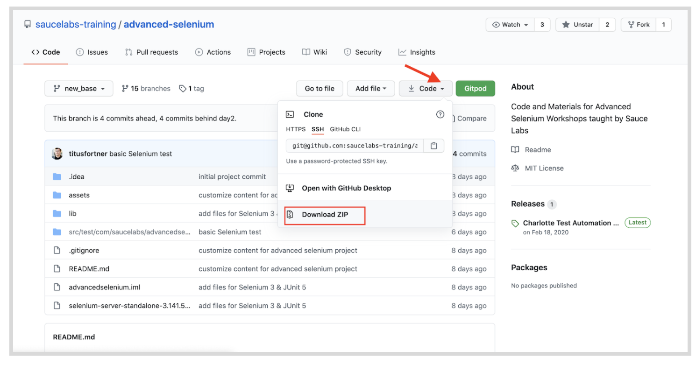
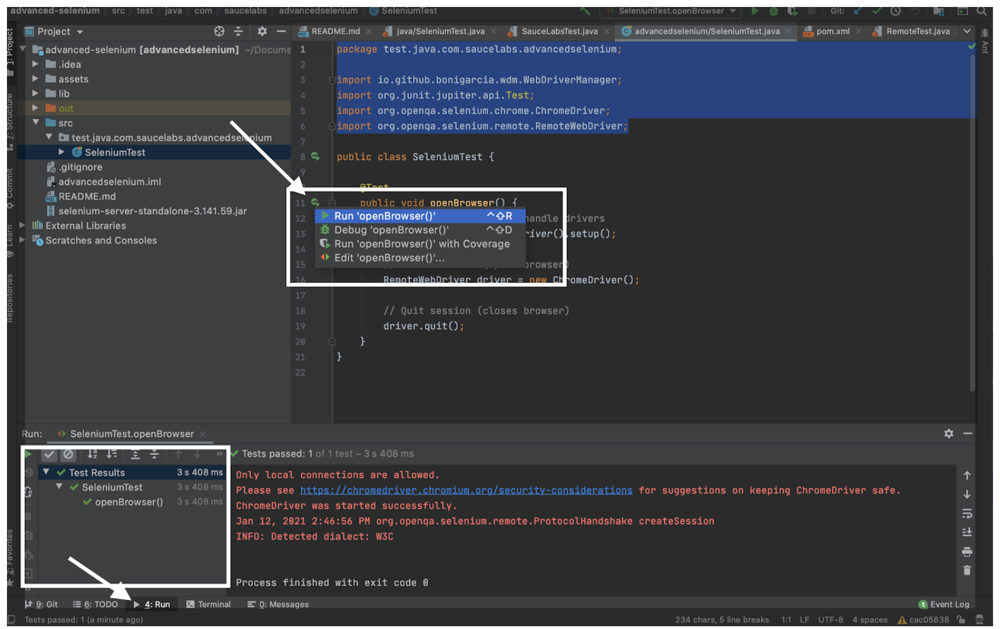
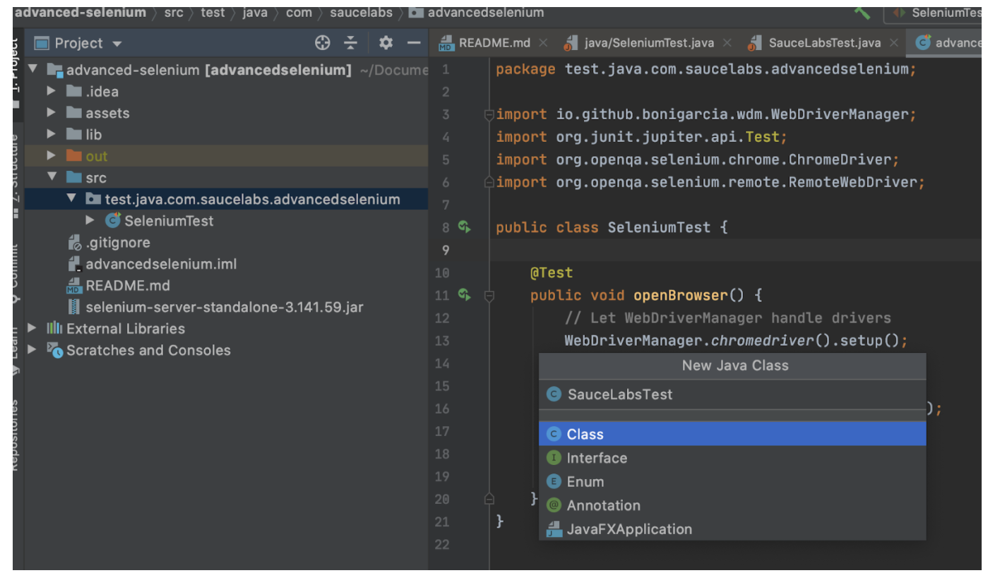

summary: Module1 of the Advanced Selenium Java Coures.
id: Module1_AdvancedSeleniumJava
categories: Java
tags: advjava  
environments: Web
status: Draft
feedback link: https://forms.gle/CGu4QchgBxxWnNJK8
author:Lindsay Walker
<!-- ------------------------ -->
# Module 1 – Advanced Selenium with Java

<!-- ------------------------ -->
## Section 1 Course Setup
Duration: 0:10:00

This course will guide you through creating a new test suite from scratch. Although it is recommended that you use Maven and a `requirements.txt` file to manage dependencies, this course will start with an complete set of dependencies in the .jar files in the /lib directory of a project


### Install Software

In this module we will walk you through getting the repository of files from Github. In order to have this set up, you should have:


*   A Github account
*   Git installed on your computer
*   A Java SDK ([Version 8 used in this example](https://www.oracle.com/java/technologies/javase/javase-jdk8-downloads.html))
*   An IDE ([IDEA Community Edition](https://www.jetbrains.com/idea/download/))


### Required Dependencies

In order to get your test files set up you should have some basic software already installed. The rest will be provided as `.jar` files as a part of the repository you will download. In this course, we will be using tools included in the IntelliJ IDE to manage which branch of test code you are looking at.

To download the base project, including the set of .jar files with dependencies, visit the **new_base** branch of the advanced-selenium course here: [https://github.com/saucelabs-training/advanced-selenium/tree/new_base](https://github.com/saucelabs-training/advanced-selenium/tree/new_base)



If you are familiar with using GitHub, you can fork the project, then use `git clone URL-to-repo` in the directory you wish to store it.


*   First, login to your Git account and make sure you have it downloaded on your computer. For the easiest workflow, [set up SSH](https://docs.github.com/en/free-pro-team@latest/github/authenticating-to-github/connecting-to-github-with-ssh) so you don’t have to enter your password for many of the git actions.
*   Next, fork the repo to create your own version that you can commit to. Click the icon to fork the branch and place it in your personal account.



*   In Terminal, run the command `git clone git@github.com:you/your-git-branch` to create a local version of the repository. Copy the link from the repository you just created.




#### Note

If you do not want to work with Git and would instead prefer to simply download the project content, simply download the .zip file wherever you would like to create your project.





Once you have a copy of the repository on your local machine, open your project with IntelliJ. Open the IntelliJ IDE, choose **Open** and navigate to where you created your local repository.

You should see a project with the following structure. Ensure that you are on the branch **new_base:**


Next, we will add our first elements for a test that can run both locally, and on Sauce Labs.


### Managing Drivers

There are three ways to manage a test. You can either check the version of the browser that you have on your machine (e.g. Chrome 86) then manually find and install the compatible driver. Doing it this way, you have to create either a Path variable (Option 1) or set the location to this driver in the code and place your driver there (Option 2) You will be using a third option.


```
// Option 1
    // Download Driver & Add to PATH Environment Variable
        for (String a : System.getenv("PATH").split(":"))
            System.out.println(a);

// Option 2
// Download manually and explicitly specify location:
        String location = System.getProperty("user.home") + "/.webdrivers/chromedriver";
        System.setProperty("webdriver.chrome.driver", location)
```


In this example, you are going to use a module called [WebDriver Manager](https://github.com/bonigarcia/webdrivermanager) which takes care of all this for you. Your Selenium Test should start out with the following code:


```
//filename: SeleniumTest
package test.java.com.saucelabs.advancedselenium;

import io.github.bonigarcia.wdm.WebDriverManager;
import org.junit.jupiter.api.Test;
import org.openqa.selenium.chrome.ChromeDriver;
import org.openqa.selenium.remote.RemoteWebDriver;

public class SeleniumTest {

    @Test
    public void openBrowser() {
        // Let WebDriverManager handle drivers
        WebDriverManager.chromedriver().setup();

        // Start session & open browser
        RemoteWebDriver driver = new ChromeDriver();

        // Quit session (closes browser)
        driver.quit();
    }
}

```


Notice the imports at the top. WebDriver Manager helps you with local execution of your web driver, and ChromeDriver helps

Run this first simple test by right clicking the green arrow that appears next to the test name, and selecting **Run ‘openBrowser()’** in the menu that appears. You should see one test run successfully if you click on the **Run** menu in the bottom menu.





You can see the code that you should have run passing with one passed test.


<!-- ------------------------ -->
## Section 2 – Run Local & Remote Tests
Duration: 0:10:00

One important basic thing that you need to be able to learn how to do is to create a test that can run using WebDriver Manager locally, or run on Sauce Labs. First you will need to create a new Java class (right click on the package **test.java.com.saucelabs.advancedselenium** and choose **New > Java Class)** called `SauceLabsTest.java`.




We are going to create a test that will allow you to switch between running locally and running on Sauce Labs, as well as use some features of the Sauce Bindings that will make it easy to set up and configure your tests.


### Create a Test with Sauce Bindings

First, import all the packages we will use with this test, including the JUnit5 classes, and create null `driver` and `session` variables using [RemoteWebDriver](https://www.selenium.dev/documentation/en/remote_webdriver/remote_webdriver_client/) and [SauceSession](https://github.com/saucelabs/sauce_bindings/blob/master/java/src/main/java/com/saucelabs/saucebindings/SauceSession.java):


```
package test.java.com.saucelabs.advancedselenium;

import com.saucelabs.saucebindings.JobVisibility;
import com.saucelabs.saucebindings.SauceOptions;
import com.saucelabs.saucebindings.SauceSession;
import io.github.bonigarcia.wdm.WebDriverManager;
import org.junit.jupiter.api.AfterEach;
import org.junit.jupiter.api.Assertions; //added with test
import org.junit.jupiter.api.BeforeEach;
import org.junit.jupiter.api.Test;
import org.openqa.selenium.By;
import org.openqa.selenium.WebElement;
import org.openqa.selenium.chrome.ChromeDriver;
import org.openqa.selenium.chrome.ChromeOptions;
import org.openqa.selenium.remote.RemoteWebDriver;
import org.openqa.selenium.support.ui.ExpectedConditions;
import org.openqa.selenium.support.ui.WebDriverWait;

import java.util.Collections;

public class SauceLabsTest {
    RemoteWebDriver driver = null;
    SauceSession session = null;
}
```


The SauceSession class is a part of [Sauce Bindings](https://github.com/saucelabs/sauce_bindings) which allow you to start a session easily on Sauce Labs. In other words, it sends your request with default capabilities (or capabilities you provide) to the Sauce server, Sauce parses the capabilities to see what VM to start.

It then starts the VM, sends the capabilities to the Selenium server or driver directly (in the case of Chrome) and then returns the driver's reply to the user's code.

Next, within the SauceLabsTest class, add in three annotations, the `@BeforeEach,` the `@Test`, and the `@AfterEach`. Each one has a method inside of it:


```
//filename test.java/SauceLabsTest.java
//...
public class SauceLabsTest {
    RemoteWebDriver driver = null;
    SauceSession session = null;

    @BeforeEach
    public void togglePlatform() {

    }
   @Test
        public void exampleTest() {
    }
    @AfterEach
    public void endSession() {
   }


}
```


You can add as many `@Test` annotations as you would like, and for every test that is run, whatever is inside of `@BeforeEach` will run before, and whatever you declare in `@AfterEach` will run after that test.


#### Update the Before Annotation

Now, if the `@Before` annotation, you will add in a method that will be used to set up each test you create, that allows you to switch between running your test locally, or on Sauce Labs. Create new `ChromeOptions`, then add an `if, elseif, else` statement:


```
//filename test.java/SauceLabsTest.java
//...
public class SauceLabsTest {
# ...

    @BeforeEach
    public void togglePlatform() {
        ChromeOptions chromeOptions = new ChromeOptions();
        if () {
        } else if () {

        }
        else {

        }
    }
#...

}
```


First, lets add the conditions for if This will check first to see if your `SELENIUM_PLATFORM `variable is `null`, and create a new driver instance using a local ChromeDriver:


```
//filename test.java/SauceLabsTest.java
//...
public class SauceLabsTest {
# ...

    @BeforeEach
    public void togglePlatform() {
        ChromeOptions chromeOptions = new ChromeOptions();
        if ((System.getenv("SELENIUM_PLATFORM") == null)) {
            WebDriverManager.chromedriver().setup();
            driver = new ChromeDriver(chromeOptions);

        } else if () {

        }
        else {

        }
    }
#...

}
```


Next, if your variable `SELENIUM_PLATFORM` is set to `SAUCE`, then it will use SauceOptions to set up a test on Sauce Labs.


```
//filename test.java/SauceLabsTest.java
//...
public class SauceLabsTest {
# ...

    @BeforeEach
    public void togglePlatform() {
        ChromeOptions chromeOptions = new ChromeOptions();
        if ((System.getenv("SELENIUM_PLATFORM") == null)) {
            WebDriverManager.chromedriver().setup();
            driver = new ChromeDriver(chromeOptions);

        } else if (System.getenv("SELENIUM_PLATFORM").equals("SAUCE")) {
            SauceOptions sauceOptions = new SauceOptions(chromeOptions);
            SauceSession sauceSession = new SauceSession(sauceOptions);
            driver = sauceSession.start();

        }
        else {

        }
    }
#...

}
```


The nice thing about Sauce Options is it will guide you in what your options are for configuring your test for Sauce Labs. In this example, it sets the `JobVisibility`, in other words, who can see the test on the Sauce Labs dashboard, to public.


```
//filename test.java/SauceLabsTest.java
//...
public class SauceLabsTest {
# ...

    @BeforeEach
    public void togglePlatform() {
        ChromeOptions chromeOptions = new ChromeOptions();
        if ((System.getenv("SELENIUM_PLATFORM") == null)) {
            WebDriverManager.chromedriver().setup();
            driver = new ChromeDriver(chromeOptions);

        } else if (System.getenv("SELENIUM_PLATFORM").equals("SAUCE")) {
            SauceOptions sauceOptions = new SauceOptions(chromeOptions);
            sauceOptions.setJobVisibility(JobVisibility.PUBLIC);// added
            SauceSession sauceSession = new SauceSession(sauceOptions);
            driver = sauceSession.start();

        }
        else {

        }
    }
#...

}
```


The last thing to do in the `else` part of the `@BeforeEach` annotation is to throw an exception if the program cannot find a variable `SELENIUM_PLATFORM`, or it is set to something it cannot recognize:


```
//filename test.java/SauceLabsTest.java
//...
public class SauceLabsTest {
# ...

    @BeforeEach
    public void togglePlatform() {
        ChromeOptions chromeOptions = new ChromeOptions();
        if ((System.getenv("SELENIUM_PLATFORM") == null)) {
            WebDriverManager.chromedriver().setup();
            driver = new ChromeDriver(chromeOptions);

        } else if (System.getenv("SELENIUM_PLATFORM").equals("SAUCE")) {
            SauceOptions sauceOptions = new SauceOptions(chromeOptions);
            sauceOptions.setJobVisibility(JobVisibility.PUBLIC);// added
            SauceSession sauceSession = new SauceSession(sauceOptions);
            driver = sauceSession.start();

        }
        else {
           throw new RuntimeException("You have no environment variable set that specifies the local or remote host");
        }
    }
#...

}
```


#### Update the Test Annotation

Now you will put a simple test inside the method in the test annotation


```
//filename test.java/SauceLabsTest.java
//...
public class SauceLabsTest {
# ...
         @Test
            public void exampleTest() {
            driver.get("https://www.saucedemo.com");
            By locator = By.className("btn_action");
            WebDriverWait wait = new WebDriverWait(driver, 30);
   }

#...

}
```


You have used the driver to get the website you are testing against, defined the element you are going to locate, and used the implicit [WebDriverWait](https://www.selenium.dev/documentation/en/webdriver/waits/) command to wait up to 30 seconds for the driver to instantiate before running the test.

Next add in the logic to make sure your locator is present, find the locator (`"btn-action"`) that you defined, click on it, and check to see what you expected to be there (the title `"Swag Labs"`)  is there.


```
//filename test.java/SauceLabsTest.java
//...
public class SauceLabsTest {
# ...
         @Test
         driver.get("https://www.saucedemo.com");
         By locator = By.className("btn_action");
         WebDriverWait wait = new WebDriverWait(driver, 30);
         wait.until(ExpectedConditions.visibilityOfAllElementsLocatedBy(locator));
         WebElement element = driver.findElement(locator);
         element.click();
         Assertions.assertEquals("Swag Labs", driver.getTitle());
   }

#...

}
```


#### Update the After Annotation

Now that you have set up and defined a test, you will need to update the `@AfterEach` annotation to end the driver session that was created for the test. If


```
//filename test.java/SauceLabsTest.java
//...
public class SauceLabsTest {
# ...
        @AfterEach
        public void endSession() {
            if (session != null) { // null if local
                session.stop(true);
            } else if (driver != null) { // null if driver not initialized
                driver.quit();
            }
        }

}
```


Notice it checks for two things. The first, is if there is no session (this happens when the test is run locally). If it was run on Sauce Labs, then it will stop the session. If the driver is null, in other words the driver was successfully initialized locally, it will quit.

All you need to do to modify this code for your own test is to modify what is in the `@Test` annotation to apply to your code. You can see all the[ available assertions here.](https://junit.org/junit5/docs/current/api/org.junit.jupiter.api/org/junit/jupiter/api/Assertions.html)

#### Example Modification
```
# ...
@Test
    public void exampleTest() {
        driver.get("https://training.saucelabs.com/");
        By locator = By.className("card__inner");
        WebDriverWait wait = new WebDriverWait(driver, 30);
        wait.until(ExpectedConditions.visibilityOfAllElementsLocatedBy(locator));
        WebElement element = driver.findElement(locator);
        element.click();
        Assertions.assertEquals("About Sauce Training", driver.findElement(By.className("banner-title")));
    }
#...
```


<!-- ------------------------ --
## Section 1
Duration: 0:10:00


<!-- ------------------------ --
## Section 1
Duration: 0:10:00


<!-- ------------------------ --
## Section 1
Duration: 0:10:00

-->
