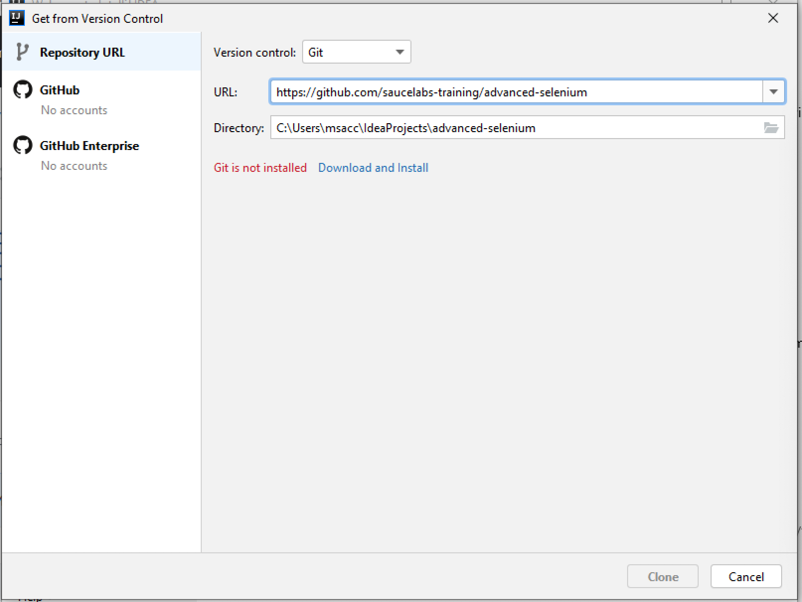

# Advanced Selenium

This open source code is for use in advanced Selenium workshops. It is based on
code written for [AddressBook tests](https://github.com/address-book/junit_tests)

See [LICENSE](https://github.com/saucelabs-training/advanced-selenium/LICENSE.md) file for details.

 

## Description

This code is updated for each course taught, and are maintained in different branches.

 

## Workshop Prerequisites

1. Install [IntelliJ Community Edition](https://www.jetbrains.com/idea/download/)
2. Install [Git](https://git-scm.com/doc)
5. Clone [This Project](https://github.com/saucelabs-training/advanced-selenium)
4. Install [JDK](https://www.oracle.com/java/technologies/javase/javase-jdk8-downloads.html)
5. Install [Chrome](https://www.google.com/chrome/)

## Installation

There are two ways to install everything needed for this course. If you are creating a 
developer environment that will be used in more than just this workshop, I recommend
installing everything separately, making sure you've followed instructions on how to make 
sure everything is recognized properly on your system.

If you just need to have a working environment for this course, or if you had a problem
with installing items separately, then we'll install everything via IntelliJ directly.

### IntelliJ

IntelliJ is an integrated development environment (IDE) that incorporates several tools for 
developing and running Java code. It is developed by JetBrains and is available 
as an open source Community edition, and in a proprietary commercial Ultimate edition. 
Either edition can be used for commercial development. 

### Git

Git is a free and open source distributed version-control system for tracking changes 
in any set of files. It lets you check out code from a repository, work with that code on your own branch, and 
then merge that code with any changes that have been made by other developers.

To Install Git via IntelliJ, start by choosing to load a project by VCS:

<kbd>

</kbd>
 
 

If Git is not properly installed, IntilliJ will show this message and provide a one-click 
option to download and install it:

<kbd>

</kbd>

### JDK

The Java Development Kit (JDK) is one of three core technology packages used in Java programming, 
along with the JVM (Java Virtual Machine) and the JRE (Java Runtime Environment). 
The JDK is required to compile and execute Java code.

Make sure you have cloned the AdvancedSelenium project onto your local machine as shown in the image from
the previous section, then open the `SeleniumTest.java` file as shown here:

<kbd>

</kbd>
 
 

If you do not have a JDK installed, IntelliJ will display a yellow warning bar at the top of the file
along with an option to download Amazon Corretto, which is a no-cost distribution of the Open Java Development Kit.

<kbd>

</kbd>

### Run a Test

To ensure that everything is working properly, right click on the `SeleniumTest.java` file and 
select `Run 'SeleniumTest'`:

<kbd>

</kbd>
 
 

You should see a Chrome browser window pop up and then go away, and the
 results in the Run Tab will show a green check mark and a "Process finished with exit code 0" message:

<kbd> 

</kbd>
